# ATIADE - Automatic Tests In A Docker Environment


This project aims to enable the execution of test runners (Selenium, RestAssured, and experimentally Playwright) through Docker. The solution consists of a docker-compose setup capable of running tests defined in Gherkin without additional dependencies, providing high portability and ease of use.

## Prerequisites

- Docker
- Docker Compose


## Project Structure

- `docker-compose.yaml`: Docker Compose configuration file to set up Selenium Grid, Chrome and Firefox nodes, and Allure reporting service.
- `src/test/java`: Directory containing your test classes and test suite XML file.

```mermaid
flowchart TD


    subgraph DockerEcosystem [Docker Ecosystem]
        subgraph TestRunner [Maven]
            A[Test Runner]:::runner -->|Executes| B[mvn test]:::command
            B -->|Locally uses| H[WebDriverManager]:::local-drivers
        end
        B -->|Send test execution to| C[Selenium Hub]:::hub
        C -->|Communicates via Event Bus| D[Chrome Node]:::node
        C -->|Communicates via Event Bus| E[Firefox Node]:::node
        B -->|Sends test results To| F[Allure Service]:::allure
    end

    classDef runner fill:#696262, stroke:#d94a4a;
    classDef command fill:#222922, stroke:#4ad94a;
    classDef hub fill:#222222, stroke:#4a4ad9;
    classDef node fill:#333333, stroke:#d94ad9;
    classDef allure fill:#414141, stroke:#d9d94a;
    classDef local-drivers fill:#323939, stroke:#4ad9d9;

    class A runner;
    class B command;
    class C hub;
    class D node;
    class E node;
    class F allure;
    class H local-drivers;

    %% Posizionamento verticale
    style TestRunner  stroke-width:3px;
    style DockerEcosystem stroke-width:4px;

```


## Setup

1. **Clone the repository**:
   ```sh
   git clone <repository-url>
   cd <repository-directory>
   ```

2. **Build and start the services**:

    ```sh
    docker-compose up --build
    ```

3. **Run your test**:
    ```sh
    docker-compose up --no-deps test-runner
    ```


## Running Tests
There are two general usage modes for running tests:
1. **Virtualized Execution**:

Browser nodes are instantiated in Docker containers, and the tests are executed using Maven inside a docker container.

The *test-runner* service in the docker-compose.yaml file is configured to run your tests using Maven. It will execute the tests defined in the src/test/java/runners/runner.xml file.
<pre>docker-compose up --build </pre>

docker-compose *up* command will build the Docker images declared on docker-compose.yaml and start the Selenium Grid, Chrome and Firefox nodes, and Allure reporting service. 

The test-runner service will be started, and the tests will be executed.

After the tests have been executed, you can view the Allure report by navigating to http://localhost:4040 in your web browser.

If you want to run the tests again, you can use the following command:
<pre>docker-compose up --no-deps test-runner </pre>

Browser type can be specified by setting the BROWSER environment variable in the docker-compose.yaml file.


2. **Local Execution**:
Browser nodes are instantiated locally, and the tests are executed using Maven.
<pre>mvn clean test -DsuiteXmlFile=src/test/java/runners/runner.xml </pre> 

If the -DsuiteXmlFile parameter is not specified, all tests will be executed.

Browser type can be specified by editing the hardcoded string on steps/cucumber/Step.java:26


## Running on External Grids

### BrowserStack

1. **Credential Configuration**:
   - Obtain your `username` and `access key` from BrowserStack.

2. **Modify the `docker-compose.yaml` file**:
   - (optional) Remove the `selenium-hub`, `chrome`, and `firefox` services.
   - Add environment variables for BrowserStack on test-runner service.

```yaml
... BrowserStack Configuration
  test-runner:
    ...
    environment:
       - BROWSER=firefox
       - HUB_HOST=hub.browserstack.com
       - HUB_PORT=80
       - BROWSERSTACK_USERNAME=<your_browserstack_username>
       - BROWSERSTACK_ACCESS_KEY=<your_browserstack_access_key>
    ...
...

... SauceLabs Configuration
  test-runner:
     ...
     environment:
        - BROWSER=firefox
        - HUB_HOST=ondemand.saucelabs.com
        - SAUCE_USERNAME=<your_sauce_username>
        - SAUCE_ACCESS_KEY=<your_sauce_access_key>
     ...
...

... AWS DeviceFarm Configuration
  test-runner:
     ...
     environment:
        - BROWSER=firefox
        - HUB_HOST=devicefarm.<region>.amazonaws.com
        - AWS_ACCESS_KEY_ID=<your_aws_access_key_id>
        - AWS_SECRET_ACCESS_KEY=<your_aws_secret_access_key>
     ...
...
```

## Viewing Allure Reports
After the tests have been executed, you can view the Allure report by navigating to http://localhost:4040 in your web browser.


## Configuration
Selenium Hub: The central component of Selenium Grid.

Chrome and Firefox Nodes: Browser nodes that connect to the Selenium Hub.

Test Runner: A Maven container that runs the tests.

Allure: A service to generate and serve Allure reports.

## Additional Information

Volumes: The docker-compose.yaml file includes volumes for allure-results and allure-reports to store test results and reports.

Plugins: The pom.xml file includes the maven-cucumber-reporting plugin to generate Cucumber HTML reports.

Environment Variables: The docker-compose.yaml file sets environment variables for the browser and Selenium Hub host.

TestNG Configuration: The src/test/java/runners/runner.xml file configures TestNG with Allure reporting.

Screenshot Utility: The project includes a ScreenshotUtil class to capture screenshots on test failure.

## Experimental Playwright Runner
In addition to Selenium and RestAssured, it is also possible to run tests using an experimental runner for Playwright. This allows for cross-browser testing with a modern automation framework.
